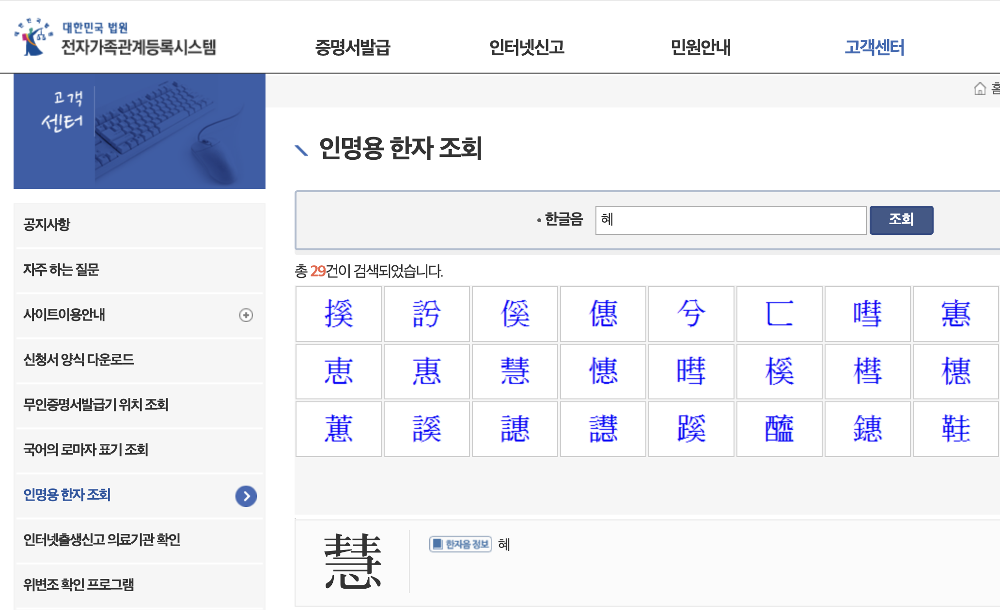

# Korean Naming Hanja Charset



This repository contains a web crawler designed to collect the Korean name Hanja (漢字) character set from the Supreme Court of Korea and Naver Dictionary. 

The dataset includes characters that can be legally used in names for birth registration or name changes in Korea.

## Background

In June 2024, the Supreme Court of Korea expanded the number of Hanja characters that can be used in names from 8,319 to 9,389, an increase of 1,070 characters. This expansion marks the largest increase since 2014. The new characters include rarely used or complex Hanja such as '㖀(률)', '疋(아)', '䬈(태)', and '汩(골)'.

The regulation on name Hanja was first introduced in December 1990 to prevent the inconvenience caused by using rarely used or difficult Hanja in names. The initial list included 2,731 characters based on educational Hanja and commonly used characters. Over the years, the list has been gradually expanded through 11 amendments, reflecting the evolving naming practices and societal needs.

For comparison, China limits name characters to 3,500, and Japan restricts them to 2,999 (2,136 common-use kanji + 863 name-use kanji).

News Reference: [대법원, 이름에 사용할 수 있는 한자 '1000자 이상' 확대](https://www.lawtimes.co.kr/news/198522)

## Source

1. [Supreme Court of Korea](https://efamily.scourt.go.kr/cs/CsBltnWrtList.do?bltnbordId=0000010)
   - 대한민국 법원 전자가족관계등록시스템 인명용 한자 조회
   - Korean Court Electronic Family Relationship Registration System Chinese Character Search for Personal Names
   - https://efamily.scourt.go.kr/cs/CsBltnWrtList.do?bltnbordId=0000010
2. [Naver Dictionary](https://hanja.dict.naver.com/#/category/name)
   - 대법원 인명한자
   - https://hanja.dict.naver.com/#/category/name

## Data

In Korean, the same Hanja character can have different pronunciations. 

Additionally, since the query results are categorized by pronunciation, there is a possibility of the same character appearing multiple times. 

**Hanja character in dataset has not yet been deduplicated.**

1. Supreme Court of Korea (10,163 characters in total)
   - `data-gov.json`: Raw data
   - `data-gov.csv`: Cleaned data 

2. Naver Dictionary (8,957 characters in total)
   - `data-naver.json`: Raw data
   - `data-naver.csv`: Cleaned data

## Usage

1. Install requirements.
 
```
pip install requests
```

2. Run the code.

**Noticed that there is a one-second interval between each loop to prevent excessive requests and avoid overloading the server's connection.**
   
```
# select the source: Supreme Court of Korea (gov) or Naver Dictionary (naver)
cd naver
# or
cd gov

# crawl raw data by request
python crawler.py

# clean json data to csv
python cleaner.py
```

## Contribution

Contributions are welcome! 

Please open an issue or submit a pull request if you find a bug or have suggestions for improvements.

## License

This project is licensed under the MIT License. 

See the LICENSE file for details.

## Acknowledgment

- [대법원에서 정한 인명용 한자: Ministry of Foreign Affairs, Republic of Korea](https://overseas.mofa.go.kr/cn-shenyang-ko/brd/m_611/view.do?seq=1064726&srchFr=&amp;srchTo=&amp;srchWord=&amp;srchTp=&amp;multi_itm_seq=0&amp;itm_seq_1=0&amp;itm_seq_2=0&amp;company_cd=&amp;company_nm=)
- [Unicode: Proposal to update kHangul and kKoreanName](https://unicode.org/L2/L2020/20082-update-korean.pdf)
- [한자/인명용 한자표: NAMU Wiki](https://namu.wiki/w/%ED%95%9C%EC%9E%90/%EC%9D%B8%EB%AA%85%EC%9A%A9%20%ED%95%9C%EC%9E%90%ED%91%9C)
- [Hangul consonant and vowel tables: Wikipedia](https://en.wikipedia.org/wiki/Hangul_consonant_and_vowel_tables)
- [Hanja: Wikipedia](https://en.wikipedia.org/wiki/Hanja)
- [字統网](https://zi.tools/)

